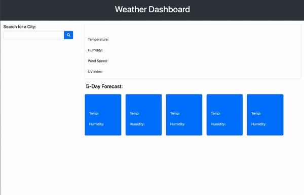

# the-weather-dashboard

## Table of Contents

* [Objective](#Objective)
* [Description](#Description)
* [Usage](#usage)
* [Credits](#credits)

 ## Objective
 
 - To build a Weather Dashboard app including a user search field with a logged list, display of current day weather data, and a 5-day forecast using a third party weather API.
 
 ## Description
 
 [GitHub](https://github.com/mbostwick1/the-weather-dashboard)
 
 [Live URL](https://mbostwick1.github.io/the-weather-dashboard/)

 ## Usage

## Credits
[Bootstrap](https://getbootstrap.com/docs/4.5/components/)
[FontAwesome Icons](https://fontawesome.com/icons/save)
[Open Weather API](https://openweathermap.org/)
[Stack Overflow Forums](https://stackoverflow.com/)
[W3 Schools JS](https://www.w3schools.com/js/)
[MDN web docs](https://developer.mozilla.org/en-US/)

